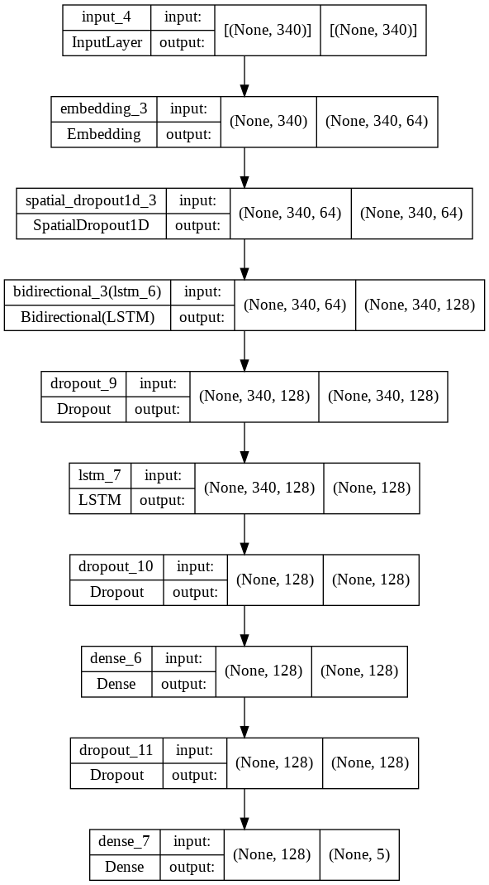
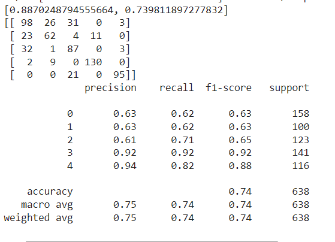
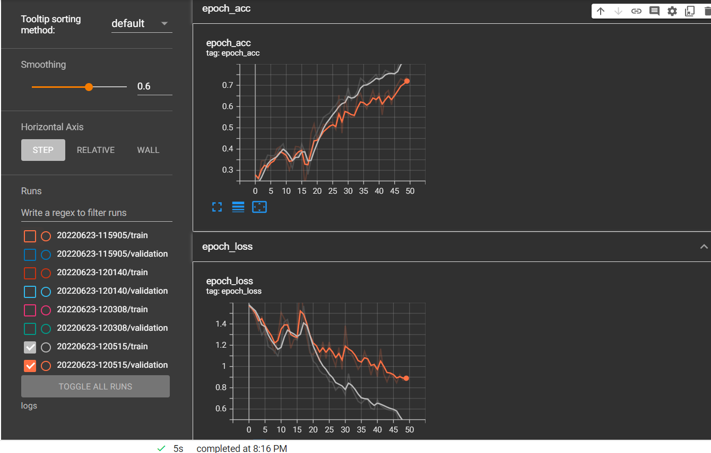

# BBC-NEWS-Classification-using-NLP

This project is about text classification ie: given a text, we would want to predict its class (tech, business, sport, entertainment or politics).

We will be using "BBC-news" [dataset](https://raw.githubusercontent.com/susanli2016/PyCon-Canada-2019-NLP-Tutorial/master/bbc-text.csv) to do following steps:

1) Data Loading      
2) Data Inspection
3) Data Cleaning
4) Preprocessing
5) Model Development
6) Model Evaluation

# Data Loading
to load our dataset in a dataframe

      DATA_PATH = 'https://raw.githubusercontent.com/susanli2016/PyCon-Canada-2019-NLP-Tutorial/master/bbc-text.csv'
      df = pd.read_csv(DATA_PATH)

# Data Inspection
To study our data type, description and to check if there's any duplicate or null in our data set

      print(df.head(10))
      df.tail(10)
      print(df.info())
      print(df.describe())

      df['category'].unique()

      print(df['text'][0])
      print(df['category'][0])

      df.duplicated().sum()

# Data Cleaning
After inspection we observed there exist 99 duplicates in our data set. Hence, we need to drop the duplicate.

      df = df.drop_duplicates()

# Preprocessing
Down below were the process that was involved during preprocessing:
### 1) Convert into lower case. 

since all already in lower case, we may skip this process.

### 2) Tokenizing
this process is to change our text into number.

            text = df['text'].values
            category = df['category'].values

            vocab_size = 10000
            oov_token = 'OOV'

            tokenizer = Tokenizer(num_words=vocab_size,oov_token=oov_token)

            tokenizer.fit_on_texts(text) # to learn all of the words
            word_index = tokenizer.word_index
            print(word_index)

            train_sequences = tokenizer.texts_to_sequences(text)

### 3) Padding & truncating
            length_of_text = [len(i) for i in train_sequences] # list comprehension
            print(np.median(length_of_text))  # to get the number of max length for padding

            max_len = 340

            padded_text = pad_sequences(train_sequences,maxlen=max_len,
                                        padding='post',
                                        truncating='post')

### 4) One Hot Encoding for the target

            ohe = OneHotEncoder(sparse=False)
            category = ohe.fit_transform(np.expand_dims(category,axis=-1))

### 5) Train test split

            X_train,X_test,y_train,y_test = train_test_split(padded_text,category,
                                                             test_size=0.3,
                                                             random_state=123)

            X_train = np.expand_dims(X_train,axis=-1)
            X_test = np.expand_dims(X_test,axis=-1)

# Model Development
Use LSTM layers, dropout, dense, input
The model is in bbc_news_module.py

            mod = ModelCreation() # the model in module_NLP.py
            model = mod.model_layer(num_node=128,drop_rate=0.2,output_node=5,
                                    embed_dims=64,vocab_size=10000)

            plot_model(model, to_file='model_plot.png', show_shapes=True,
                       show_layer_names=True)

            model.compile(loss='categorical_crossentropy',optimizer='adam',metrics = ['acc'])

            tensorboard_callback = TensorBoard(log_dir=HEART_LOG_FOLDER_PATH)

            hist = model.fit(X_train,y_train,
                             epochs=50, batch_size=128,
                             validation_data=(X_test,y_test),
                             callbacks=[tensorboard_callback])

below is our model architecture:

# Model Evaluation
during this step we will study our model accuracy and loss to check the effectiveness of our model.

            hist.history.keys()

            plt.figure()
            plt.plot(hist.history['loss'],'r--',label='Training loss')
            plt.plot(hist.history['val_loss'],label='Validation loss')
            plt.legend()
            plt.plot()

            plt.figure()
            plt.plot(hist.history['acc'],'r--',label='Training acc')
            plt.plot(hist.history['val_acc'],label='Validation acc')
            plt.legend()
            plt.plot()

            Eva = Model_Evaluate()
            Eva.EvaluateMymodel(model,X_test,y_test)
            
below is our model acurracy and f1 score:

and here is our validation and training loss plot using tensorboard:

